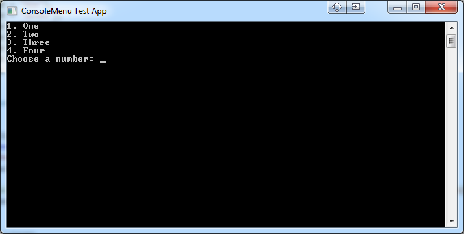
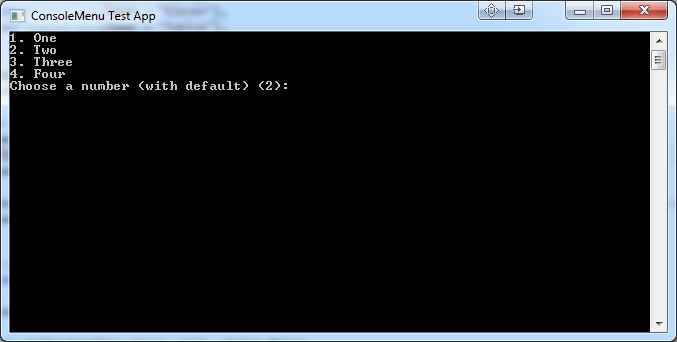
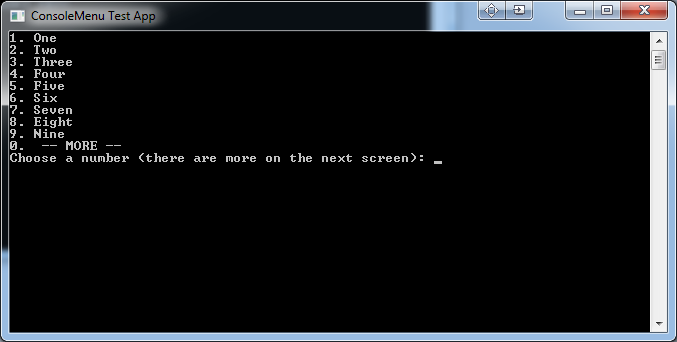

# ConsoleMenu [](https://www.nuget.org/packages/ConsoleMenu) [](https://www.nuget.org/packages/ConsoleMenu)

Provide an easy means of providing simple console applications with menu options.

Features
--------
The following features are currently implemented in ConsoleMenu:

- Single Character Selectable Menus
	- Items are selected as simply as pressing a single character on the keyboard.
- Typed Menus
	- Given a list of objects, the item chosen will be returned to you.
- Create Automatically Numbered Menus
	- It is easy to create a menu that accepts the input from 1-9.
- Automatic Overflow
	- If using the automated number menu, if the list contains more than 9 items, the menu will automatically be paginated.


Future Features
---------------
- Make Menus Cancellable
	- At current, there is no way to go back from a menu; you must make a valid choice to revert control back to the calling code.
- Tidy up API
	- Some internal changes including the introduction of cleaner factory methods.


Examples
--------
The easiest method of creating a menu in ConsoleMenu is to use the `TypedMenu` class.
This class takes a list of objects that the menu will be created for, the instructional text to be displayed and a lambda that defines how to retrieve the text to display for each menu item.

To create one, simply create a new object:

```C#
var choices = new List<SimpleClass>
{
    new SimpleClass{Name = "One"},
    new SimpleClass{Name = "Two"},
    new SimpleClass{Name = "Three"},
    new SimpleClass{Name = "Four"},
};

var menu = new TypedMenu<SimpleClass>(choices, "Choose a number", x => x.Name);
```

The menu can then be displayed using the `Display()` method:

```C#
SimpleClass pickedObject = menu.Display();
```


An alternative method would be to create `MenuItem` instances manually and to add them to a new instance of the `Menu` class directly.


Screenshots
-----------
Here we have a very simple menu that is linked against the keys 1-4. Hitting one of these values will return the given choice.  

 
This menu has a default value set, hitting enter will return you the value at the index notated in the brackets.  


This menu has more items than can fit in the standard 1-9 numbered menu therefore an extra item has been added that will take you to the next page.  



Changelog
---------
The changelog can be viewed [here](doc/Changelog.md).
